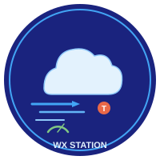
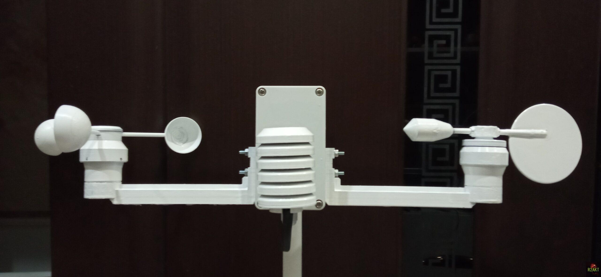

# Метеостанция

<p align="center">
  
</p>

<p align="center">
  
</p>

<p align="center">
  Автономная метеостанция: Arduino + ENC28J60, многопротокольный вывод (APRS / MQTT / WeeWX)
</p>

<p align="center">
  <a href="README.md">English version</a>
</p>

---

## Обзор системы

```
┌────────────────────────────────────────────────────────────────────┐
│  МЕТЕОСТАНЦИЯ (Arduino Nano + ENC28J60)                            │
│                                                                    │
│  ┌─────────┐  ┌─────────┐  ┌─────────┐  ┌────────┐  ┌────────┐     │
│  │ DS18B20 │  │ BME280  │  │ SHT31   │  │AS5600  │  │TLE4934 │     │
│  │(1-Wire) │  │(I2C)    │  │(I2C)    │  │(I2C)   │  │(GPIO)  │     │
│  └────┬────┘  └────┬────┘  └────┬────┘  └───┬────┘  └───┬────┘     │
│       │            │            │           │           │          │
│       └────────────┴────────────┴───────────┴───────────┘          │
│                                   │                                │
│                              ┌────┴────┐                           │
│                              │ Arduino │ ← Timer1 ISR (1 Гц)       │
│                              │  Nano   │                           │
│                              └────┬────┘                           │
│                                   │                                │
│                              ┌────┴────┐                           │
│                              │ENC28J60 │ → UDP broadcast :4001     │
│                              └────┬────┘                           │
└───────────────────────────────────┼────────────────────────────────┘
                                    │
                    ┌───────────────┼───────────────┐
                    │               │               │
                    ▼               ▼               ▼
              ┌───────────┐   ┌───────────┐   ┌───────────┐
              │  Gen_WX   │   │WX_2_MQTT  │   │WX_2_WEE   │
              │  (APRS)   │   │  (MQTT)   │   │ (WeeWX)   │
              └───────────┘   └───────────┘   └───────────┘
```

**Все три Python-сервиса слушают один UDP-порт 4001** и разбирают один и тот же 36-байтовый бинарный пакет. Каждый конвертирует данные в свой формат вывода.

---

## Аппаратная часть

### Мастер (WX_MASTER)

| Компонент | Интерфейс | Назначение |
|-----------|-----------|------------|
| Arduino Nano (ATmega328P) | - | Основной контроллер |
| ENC28J60 | SPI | Ethernet (пассивный PoE) |
| DS18B20 | 1-Wire | Температура воздуха (экран Стевенсона) |
| BME280 | I2C (0x76) | Атмосферное давление (вентилируемый корпус) |
| SHT31 | I2C (0x44) | Относительная влажность (подогрев каждые 30 с) |
| AS5600 | I2C | Направление ветра (магнитный, 14 бит) |
| TLE4934 | GPIO (интеррапт) | Скорость ветра (Hall, 2 имп./об, 4 магнита) |

> **Датчик скорости ветра:** 4 неодимовых магнита с чередованием полярности установлены на чашечках анемометра. TLE4934 формирует 2 импульса на оборот. Чередование полярности обеспечивает надёжное подавление ложных срабатываний в зоне переключения.

### Слейв (WX_SLAVE)

| Компонент | Назначение |
|-----------|------------|
| Arduino Nano | Контроллер LCD-дисплея |
| ENC28J60 | Приём UDP (порт 4001) |
| 1602 LCD (I2C) | Отображение: MAC, T+P, H+W, Dir |

---

## Первичные источники данных

| Измерение | Источник | Примечание |
|-----------|----------|------------|
| Температура | DS18B20 | В экране Стевенсона |
| Влажность | SHT31 | Подогрев каждые 30 с (температура игнорируется) |
| Давление | BME280 | Атмосферное (вентилируемый корпус) |
| Скорость ветра | TLE4934 | Hall-датчик, 2 имп./об |
| Направление ветра | AS5600 | Магнитный, 14 бит |

---

## UDP-протокол (36 байт, бинарный)

Broadcast на `255.255.255.255:4001`, 1 Гц.

| Смещение | Размер | Тип | Поле |
|----------|--------|-----|------|
| 0-5 | 6 | bytes | MAC-адрес |
| 6-9 | 4 | float32 LE | DS18B20 Температура (°C) ** [первичный] |
| 10-13 | 4 | float32 LE | BME280 Температура (°C) |
| 14-17 | 4 | float32 LE | BME280 Относительная влажность (%) |
| 18-21 | 4 | float32 LE | BME280 Давление (мм рт.ст.) ** [первичный] |
| 22-25 | 4 | float32 LE | SHT31 Температура (°C) |
| 26-29 | 4 | float32 LE | SHT31 Относительная влажность (%) ** [первичный] |
| 30-31 | 2 | int16 LE | Направление ветра (0-360°) |
| 32-35 | 4 | float32 LE | Скорость ветра (м/с) |

### Кодирование NaN / ошибки

| Датчик | Значение-заглушка |
|--------|-------------------|
| Температура (любой) | -127.0 °C |
| Влажность (любая) | 100.0 % → ограничено 99 |
| Давление | 100.0 мм рт.ст. |
| Ветер | 0 |

### Валидация диапазонов

| Поле | Допустимый диапазон |
|------|---------------------|
| Температура | -50 … +50 °C |
| Давление | 700 … 800 мм рт.ст. |
| Влажность | 0 … 99 % |
| Направление ветра | 0 … 360° (значения > 360 сворачиваются в 0) |

---

## Программные компоненты

| Файл | Версия | Функция |
|------|--------|---------|
| `WX_master.ino` | v0.6.0 | Arduino: чтение датчиков, UDP 1 Гц |
| `WX_slave.ino` | v0.4.0 | Arduino: приём UDP, вывод на LCD |
| `Gen_WX.py` | v0.6.0 | APRS-сводки (WX.txt, WX_hum.txt, WX_hyb.txt) |
| `WX_2_MQTT.py` | v0.5.0 | MQTT-публичер (21 топик) |
| `WX_2_WEE.py` | v0.3.0 | Мост WeeWX (протокол Tempest v1.7.1) |
| `wx_common.py` | - | Общий модуль: парсер пакета, WindTracker, утилиты |
| `WX_emulator.py` | - | Генератор UDP-пакетов (для тестов) |

---

## MQTT-вывод

Базовый топик: `WX_Station/`

### Данные датчиков

| Топик | Тип | Описание |
|-------|-----|----------|
| `sensor/temperature` | float | Температура воздуха (°C, DS18B20) |
| `sensor/humidity` | float | Относительная влажность (%, SHT31) |
| `sensor/pressure` | float | Барометрическое давление (мм рт.ст.) |
| `sensor/wind_speed` | float | Текущая скорость ветра (м/с) |
| `sensor/wind_dir` | int | Текущее направление ветра (°) |
| `sensor/wind_gust` | float | Мгновенный максимум (м/с) |
| `sensor/wind_avr_1m` | float | 1-мин среднее (м/с) |
| `sensor/wind_max_1m` | float | 1-мин максимум/порыв (м/с) |
| `sensor/wind_avr_10m` | float | 10-мин среднее (м/с) |
| `sensor/wind_max_10m` | float | 10-мин максимум (м/с) |
| `sensor/wind_avr_1h` | float | 1-час среднее (м/с) |
| `sensor/wind_max_1h` | float | 1-час максимум (м/с) |
| `sensor/bme_temperature` | float | Температура BME280 (°C, справочная) |
| `sensor/sht_temperature` | float | Температура SHT31 (°C, справочная) |
| `sensor/bme_humidity` | float | Влажность BME280 (%, справочная) |
| `sensor/sht_humidity` | float | Влажность SHT31 (%, первичная) |

### Производные значения

| Топик | Тип | Описание |
|-------|-----|----------|
| `sensor/dew_point` | float | Температура росы (°C, формула Магнуса) |
| `sensor/wind_chill` | float | Ощущаемая температура (°C) |
| `sensor/pressure_trend_30m` | float | Тренд давления 30 мин (гПа) |
| `sensor/sensor_health` | JSON | `{status, temp_spread, hum_spread, online}` |
| `sensor/weather_prediction` | string | `stable` / `rain_likely` / `clearing` / `fog_possible` / `strong_wind` / `change_expected` |

### Система

| Топик | Описание |
|-------|----------|
| `status` | Heartbeat / статус станции |

**Всего: 21 топик.**

---

## Интеграция с WeeWX (Tempest Protocol v1.7.1)

`WX_2_WEE.py` отправляет JSON в WeeWX (порт 4002) по протоколу WeatherFlow:

| Тип сообщения | Частота | Поля |
|--------------|---------|------|
| `rapid_wind` | каждый 1 Гц | timestamp, скорость (м/с), направление (°) |
| `obs_st` | каждые 1 мин | 18 полей: wind avg/max/dir, pressure, temp, humidity, lightning, battery, interval |
| `obs_air` | каждые 1 мин | 8 полей: pressure, temp, humidity, lightning, battery, interval |

### Ключевые настройки `weewx.conf`

```ini
[Station]
station_type = WeatherFlowUDP

[WeatherFlowUDP]
driver = user.weatherflowudp
udp_address = 127.0.0.1
udp_port = 4002
udp_timeout = 180
share_socket = true

[[sensor_map]]
outTemp = air_temperature.A8610A000101.obs_air
outHumidity = relative_humidity.A8610A000101.obs_air
pressure = station_pressure.A8610A000101.obs_air
windSpeed = wind_speed.A8610A000101.rapid_wind
windDir = wind_direction.A8610A000101.rapid_wind
```

---

## APRS-вывод (Gen_WX.py)

Три файла, генерируемые каждый 1-минутный цикл ветра:

| Файл | Формат |
|------|--------|
| `WX.txt` | APRS микроформат: `!lat/lon_cDDDsSSSgGGGtTTThHHbPPPPPCOMMENT` |
| `WX_hum.txt` | Читаемый: `:lat/lon_comment: Температура, Ветер, Влажность, Давление` |
| `WX_hyb.txt` | Гибридный: APRS + читаемый в одном сообщении |

**Пример (WX.txt):**
```
!5556.34N/03758.45E_c090s007g007t015h54b1006 shchyolkovo WX station
```

**Пример (WX_hum.txt):**
```
:=5556.34N/03758.45E_Щёлково МС: Температура => 2.5 C; Ветер => 3.2 м/с, В; Порыв => 7.8 м/с; Влажность => 54 %; Давление => 741 мм рт.ст.
```

---

## Структура файлов

```
wx/
├── README.md
├── README.ru.md
├── LICENSE
├── Addendum.txt
├── docs/
│   ├── logo.svg
│   └── station.jpg
├── wx_common.py
├── Gen_WX.py
├── WX_2_MQTT.py
├── WX_2_WEE.py
├── WX_emulator.py
├── WX_master.ino
├── WX_slave.ino
├── weewx.conf
└── tests/
    ├── test_v171.py
    ├── test_calculations.py
    ├── test_mqtt_integration.py
    ├── test_integration.py
    ├── test_compare.py
    └── test_originals.py
```

---

## Установка

### 1. Arduino Мастер

1. Установить библиотеки **EtherCard** (JeeLabs) + **DallasTemperature**
2. Открыть `WX_master.ino` в Arduino IDE
3. Настроить сеть (DHCP или статический IP)
4. Загрузить на Arduino Nano

### 2. Python-сервисы

```bash
# Установить зависимости
pip install paho-mqtt

# Запустить сервисы (в отдельных терминалах или как systemd-сервисы)
python Gen_WX.py         # APRS-вывод
python WX_2_MQTT.py      # MQTT-публичер
python WX_2_WEE.py       # Мост WeeWX
```

**Конфигурация** находится в начале каждого Python-файла (lat/lon, IP MQTT-брокера, пути к файлам).

### 3. WeeWX

1. Установить WeeWX 5.x с драйвером WeatherFlowUDP
2. Скопировать `weewx.conf` и настроить параметры станции
3. Убедиться, что порт 4002 свободен для приёма от `WX_2_WEE.py`

### 4. Тесты

```bash
cd tests
python test_v171.py           # Соответствие протоколу (73 теста)
python test_calculations.py   # Производные расчёты
python test_mqtt_integration.py  # Полный MQTT-пайплайн
```

---

## Алгоритм WindTracker

`WindTracker` в `wx_common.py` поддерживает три уровня скользящей статистики:

| Уровень | Выборки | Источник |
|---------|---------|----------|
| 1-минутный | 60 сырых сэмплов (1 Гц) | Прямой |
| 10-минутный | 10 одно-минутных средних | Из 1-мин уровня |
| 1-часовой | 6 десяти-минутных средних | Из 10-мин уровня |

- **Среднее** = сумма / длина массива (включает нулевые слоты)
- **Максимум** = max всех сэмплов в окне
- **Среднее максимумов** = среднее из максимумов за каждый цикл

Направление отслеживается отдельно методом векторного усреднения (не круговое среднее) для 1-минутного периода, затем распространяется на более длинные периоды.

---

## Производные расчёты

### Точка росы (формула Магнуса)

```
γ = ln(RH/100) + 17.67 × T / (243.5 + T)
T_dp = 243.5 × γ / (17.67 - γ)
```

### Ощущаемая температура

Валидна для T < 10 °C и V > 1.39 м/с:

```
V_kmh = V_ms × 3.6
T_wc = 13.12 + 0.6215×T - 11.37×(V_kmh^0.16) + 0.3965×T×(V_kmh^0.16)
```

### Тренд давления (30 мин)

```
Trend (гПа) = (P_current - P_avg_30min) × 1.33322
```

Скользящий буфер: 60 сэмплов (1-мин среднее) → 30-сэмпловое 30-мин среднее.

### Прогноз погоды (эвристика)

| Условие | Результат |
|---------|-----------|
| trend < -3 гПа AND RH > 80% | `rain_likely` |
| trend < -2 гПа | `change_expected` |
| trend > +3 гПа | `clearing` |
| (T - dp) < 3 °C AND T < 15 °C | `fog_possible` |
| Wind > 10 м/с | `strong_wind` |
| иначе | `stable` |

### Здоровье датчиков

| Проверка | Порог warning |
|----------|---------------|
| Расхождение температур (DS18 vs SHT31) | > 3 °C |
| Расхождение влажности (BME vs SHT31) | > 10 % |

Статус: `ok` → `warning` → `offline` (обнаружен NaN).

---

## Лицензия

[MIT](LICENSE) + [Дополнение](Addendum.txt)

Copyright (c) 2024-2026 R2AKT — Щёлково, Россия
